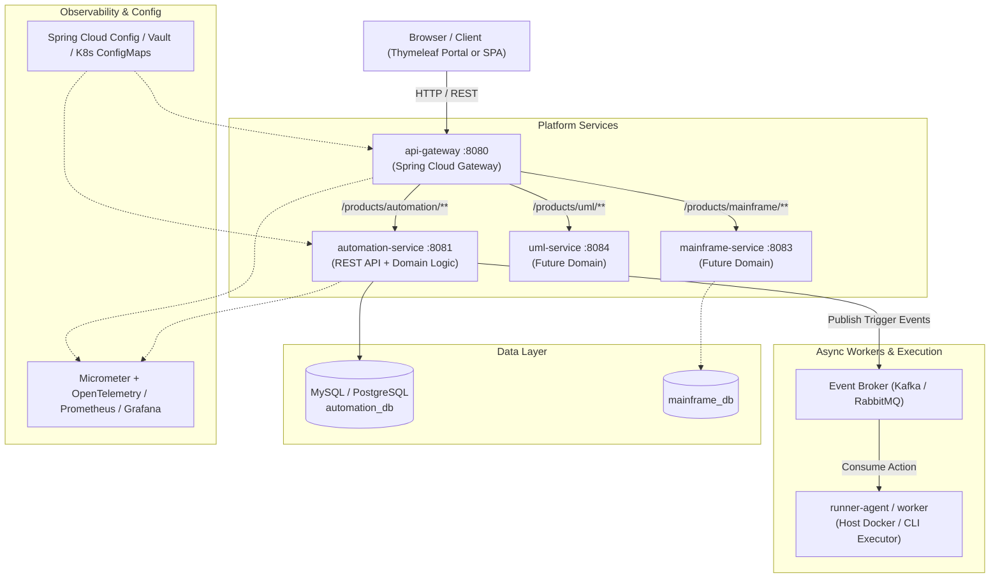

```mermaid

flowchart TD
Client["Browser / Client (Thymeleaf Portal or SPA)"] -->|HTTP / REST| Gateway["api-gateway :8080<br/>(Spring Cloud Gateway)"]

    subgraph Platform Services
        Gateway -->|/products/automation/**| AutoSvc["automation-service :8081<br/>(REST API + Domain Logic)"]
        Gateway -->|/products/mainframe/**| MainframeSvc["mainframe-service :8083<br/>(Future Domain)"]
        Gateway -->|/products/uml/**| UmlSvc["uml-service :8084<br/>(Future Domain)"]
    end

    subgraph Async Workers & Execution
        AutoSvc -->|Publish Trigger Events| Kafka["Event Broker (Kafka / RabbitMQ)"]
        Kafka -->|Consume Action| Runner["runner-agent / worker<br/>(Host Docker / CLI Executor)"]
    end

    subgraph Data Layer
        AutoSvc --> DB1[("MySQL / PostgreSQL<br/>automation_db")]
        MainframeSvc -.-> DB2[("mainframe_db")]
    end

    subgraph Observability & Config
        Config["Spring Cloud Config / Vault / K8s ConfigMaps"] -.-> Gateway
        Config -.-> AutoSvc
        Telemetry["Micrometer + OpenTelemetry / Prometheus / Grafana"]
        Gateway -.-> Telemetry
        AutoSvc -.-> Telemetry
    end

```
